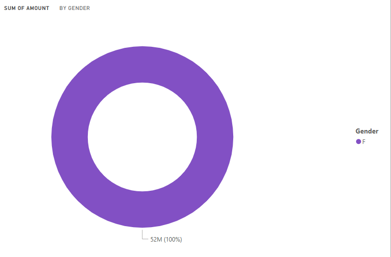
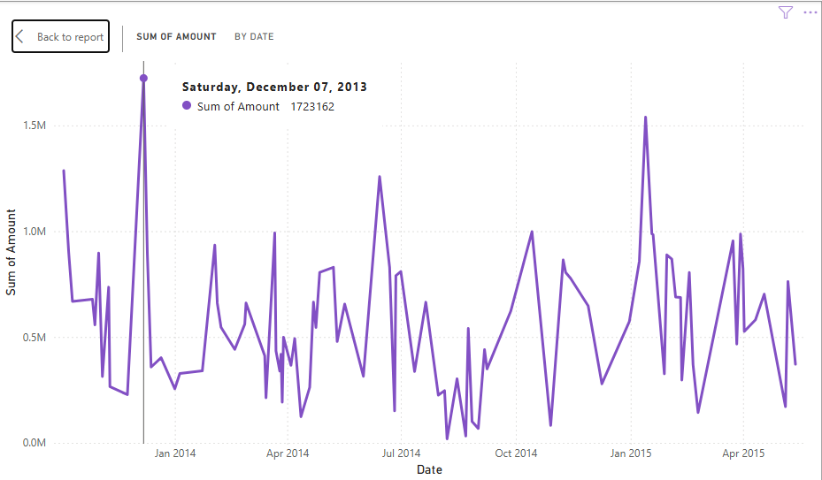
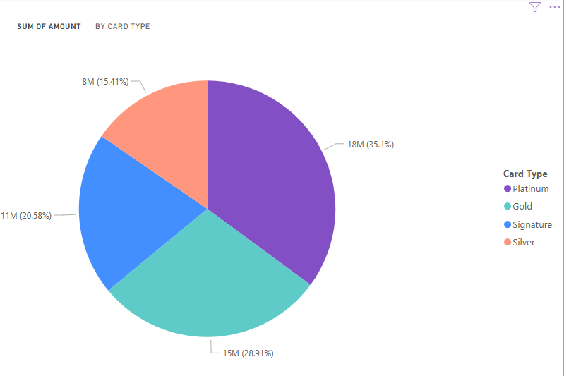

# Credit-Card-Spending
# 💳 Credit Card Spending Dashboard (Power BI)

This project presents an interactive **Power BI dashboard** that visualizes and analyzes **credit card spending** data. It provides deep insights into consumer behavior, spending categories, and trends across various dimensions.

## 📊 Features

- **Total Spending Overview**: Visual representation of overall spending across all categories.
- **Monthly Trends**: Line and bar charts showing spending patterns over time.
- **Top Spenders**: Highlight of individuals or accounts with the highest spending.
- **Interactive Filters**: Easily drill down by date, category, or user to gain specific insights.

## 📷 Screenshots

Here are some visuals from the dashboard:

### Dashboard Overview

📂 Visual Insights
📌 Donut Chart - Amount Spend by gender

📌 Line and Clustered Column Chart - Comparison View
Visualizes spending of amount by card type and city.

📌 Line Chart - Monthly Spending Trend
Shows how spending varies month-by-month.

📌 Pie Chart - Spending Distribution
A clean visual for distribution of spending .

📌 Scatter Plot - Amount vs Card type
Helps analyze spending concentration across categories .

📌 Stacked Column Chart -amount spend in cities by card type
Displays spending by cities over card type, useful for pattern analysis.

📌 KPI Card View - Key Metrics
Shows important figures like total spending, max category, average spend, etc.

## 🛠️ Built With

- **Power BI Desktop** – Data visualization and dashboard design
- **.pbix File** – `Credit Card Spending.pbix` included for review and editing

## 🛠 How to Use This Project

1. Download the `.pbix` file from this repository.
2. Open it using **Power BI Desktop** (you can download it from the [Power BI website](https://powerbi.microsoft.com/en-us/downloads/)).
3. View and explore the dashboard.
4. You can filter the data, edit visuals, or add your own data if you want.

   
## 🧑‍💻 Author
 
This project is created by **Anamika Singh**.  
Feel free to check out my other work or connect with me!

---

